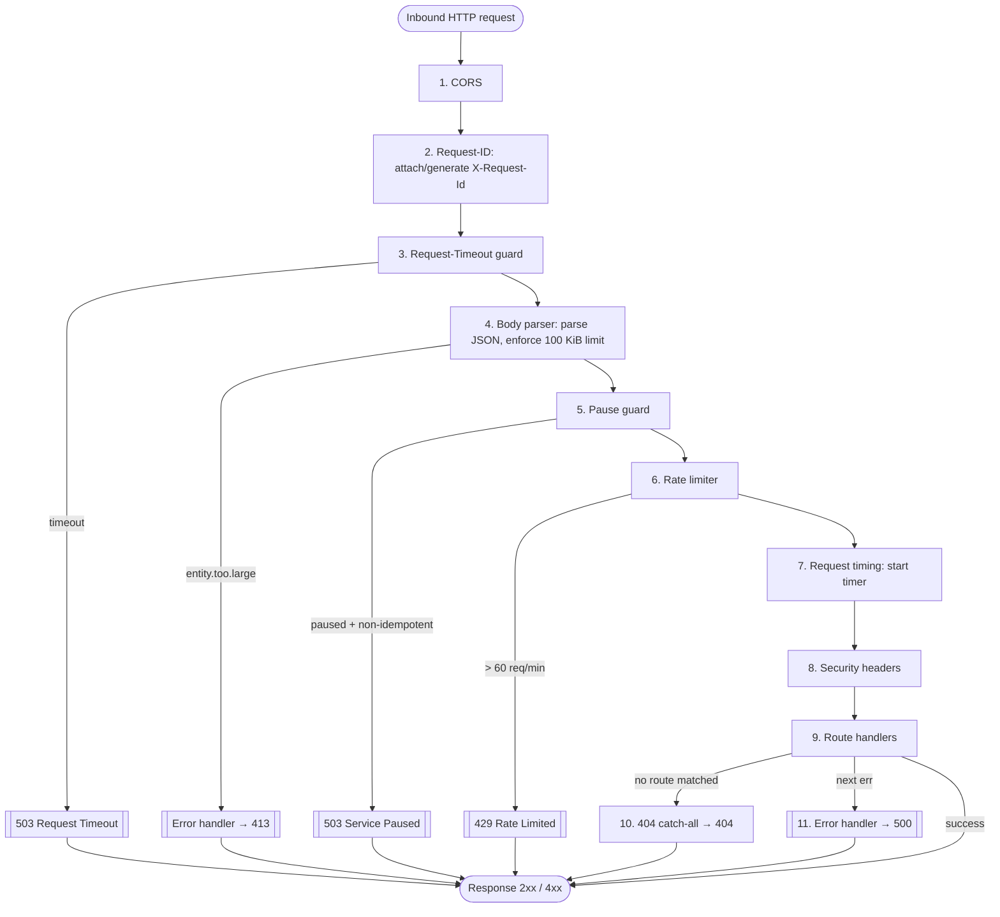

# Architecture & Request Lifecycle

This document describes the internal architecture of the StableRoute backend, covering the in-memory data model, the Express middleware chain in execution order, and the canonical error envelope. It is intended for contributors who need to understand how a request flows through the system before making changes.

## Table of Contents

1. [In-Memory Store Model](#in-memory-store-model)
2. [Middleware Chain](#middleware-chain)
3. [Request Lifecycle Diagram](#request-lifecycle-diagram)
4. [Error Short-Circuits](#error-short-circuits)
5. [Canonical Error Envelope](#canonical-error-envelope)
6. [Why Ordering Matters](#why-ordering-matters)

---

## In-Memory Store Model

All runtime state lives in `src/stores.ts`. There is no persistent storage layer yet — process restart resets every store. A database adapter is planned; until then, `resetStores()` is the test-isolation helper called in `beforeEach` / `afterEach` hooks.

| Store          | Type                        | Purpose                                                |
| -------------- | --------------------------- | ------------------------------------------------------ |
| `pairRegistry` | `Set<string>`               | Registered `"SOURCE::DEST"` pair keys                  |
| `pairMeta`     | `Map<string, PairMeta>`     | Per-pair fee / amount / liquidity metadata             |
| `apiKeyStore`  | `Map<string, ApiKeyRecord>` | Generated API key records                              |
| `webhookStore` | `Map<string, WebhookRecord>`| Registered webhook records                             |
| `eventLog`     | `AppEvent[]`                | Bounded ring-buffer of application events (cap 1 000)  |
| `rateBuckets`  | `Map<string, number[]>`     | Per-IP sliding-window timestamps used by rate limiter  |
| `config`       | `Record<string, number>`    | Tunable runtime config (rate limits, bulk caps)        |
| `paused`       | `boolean`                   | Service-level pause flag (toggled via admin endpoints) |

---

## Middleware Chain

Every inbound HTTP request passes through the following layers **in registration order**. The order is load-bearing — moving any layer changes observable behaviour and may break correlations or security guarantees.

| # | Layer | Status codes emitted | Source |
|---|-------|----------------------|--------|
| 1 | **CORS** (`cors()`) | — | `app.use(cors())` |
| 2 | **Request-ID correlation** | — | inline middleware |
| 3 | **Request-Timeout guard** | 503 | inline middleware |
| 4 | **Body parser** (`express.json`) | 413 | `app.use(express.json(...))` |
| 5 | **Pause guard** | 503 | inline middleware |
| 6 | **Rate limiter** | 429 | inline middleware |
| 7 | **Request timing** | — | inline middleware |
| 8 | **Security headers** | — | inline middleware |
| 9 | **Route handlers** | 200 / 201 / 204 / 400 / 404 | `app.get/post/patch/delete` |
| 10 | **404 catch-all** | 404 | `app.use` after routes |
| 11 | **Error handler** | 413 / 500 | 4-argument `app.use` |

### Layer details

**1. CORS**  
Applies permissive CORS headers so browser clients can reach the API. Placed first so pre-flight OPTIONS requests are answered before any app logic runs.

**2. Request-ID correlation** (defined in `src/index.ts`)  
Reads the optional `X-Request-Id` header (max 200 chars) or generates a `randomUUID()`. Attaches the id to `req.id` and echoes it as `X-Request-Id` in the response. Runs **before** the timeout guard and body parser so any error or timeout can still include the correlation id in the JSON response.

**3. Request-Timeout guard**  
Arms a timer (defaulting to 10s, configurable via `REQUEST_TIMEOUT_MS` or `config.requestTimeoutMs`). If the request does not finish within the deadline, it short-circuits the request and responds with `503 request_timeout`. Clears the timer on response finish/close to prevent leaks.

**4. Body parser** (`express.json`, limit 100 KiB)  
Parses `application/json` bodies. If the payload exceeds 100 KiB, Express emits an `entity.too.large` error that is caught by the final error handler and translated into a 413 response (with the correlation id already set).

**5. Pause guard**  
When the `paused` flag is `true`, all non-idempotent methods (anything except `GET`, `HEAD`, `OPTIONS`) are rejected with 503 — **except** `POST /api/v1/admin/unpause`, so an operator can always recover without restarting the process.

**6. Rate limiter** (per-IP sliding window)  
Enforces a default of 60 requests per 60-second window using timestamps stored in `rateBuckets`. Disabled when `NODE_ENV === "test"` so the Jest suite can make many requests freely. Returns 429 with a `Retry-After: 60` header on violation.

**7. Request timing**  
Hooks `res.on("finish")` to emit a single structured JSON log line containing `requestId`, `method`, `path`, `status`, and `durationMs`. Also sets the `Server-Timing` header for browser DevTools visibility. Suppressed when `NODE_ENV === "test"` to keep test output clean.

**8. Security headers**  
Sets four hardening headers on every response:
- `X-Content-Type-Options: nosniff`
- `X-Frame-Options: DENY`
- `Referrer-Policy: no-referrer`
- `Strict-Transport-Security: max-age=31536000; includeSubDomains`

**9. Route handlers**  
Registered `app.get/post/patch/delete` handlers. Each handler validates its inputs and calls `sendError` for client errors or `res.json` for success. Unhandled exceptions propagate to the error handler via `next(err)`.

**10. 404 catch-all**  
An `app.use` registered after all routes returns a structured 404 using `sendError` for any path/method combination that did not match a route.

**11. Error handler** (4-argument `app.use`)  
Catches any error passed to `next(err)` or thrown synchronously in a handler. Translates `entity.too.large` (body-parser overflow) into 413; all other errors become 500. The response always uses the canonical `{ error, message, requestId }` shape.

---

## Request Lifecycle Diagram

The following Mermaid diagram shows how a normal request (left) and an error request (right) flow through the chain.



---

## Error Short-Circuits

Three middleware layers can short-circuit the chain before any route handler runs:

| Trigger | Layer | Status | `error` field |
|---------|-------|--------|---------------|
| Request duration exceeds timeout | Request-Timeout guard | 503 | `request_timeout` |
| Body > 100 KiB | Body parser → Error handler | 413 | `payload_too_large` |
| Service paused + mutating method | Pause guard | 503 | `service_paused` |
| > 60 requests / 60 s from one IP | Rate limiter | 429 | `rate_limited` |

In all cases the `X-Request-Id` header is already set (layer 2 runs first), so the correlation id appears in the JSON response body and the response header.

---

## Canonical Error Envelope

Every error response — whether from a route handler, the 404 catch-all, or the global error handler — uses the same shape produced by `sendError` in `src/index.ts`:

```jsonc
{
  "error": "snake_case_error_code",  // machine-readable
  "message": "Human-readable detail.",
  "requestId": "uuid-or-caller-supplied-id",
  // optional extra fields (e.g. method, path on 500)
}
```

Clients can branch on `error` for programmatic handling and log `requestId` for cross-service tracing.

---

## Why Ordering Matters

The registration order is deliberate and each position choice has a reason:

- **Request-ID before body parser**: body-parse errors (413) are propagated to the error handler. If the id middleware ran *after* the parser, those errors would have no correlation id. The comment in `src/index.ts` reads: *"Attach an X-Request-Id before body parsing so parser errors can still return the canonical error shape with a correlation id."*

- **Pause guard before rate limiter**: the pause guard uses a simple boolean check and should never consume a rate-limit slot. If the order were reversed, a paused-service 503 would still decrement the caller's rate bucket.

- **Rate limiter before timing**: the timing middleware hooks `res.on("finish")` to log the completed request. Placing it after the rate limiter means rate-limited requests are also timed and logged, providing full observability on rejected traffic.

- **Security headers after timing**: timing attaches a listener but does not send a response, so the headers middleware can still set headers on every response regardless of which downstream layer sends it.

- **Error handler last**: Express identifies the global error handler by its four-argument signature `(err, req, res, next)`. It must be the final `app.use` call; any handler registered after it would be unreachable from the error path.

> **Inserting new middleware**: if you add authentication middleware, place it **after** the body parser (so the body is available for token extraction) and **before** the route handlers. The pause guard and rate limiter should remain before auth to avoid wasting auth work on paused or rate-limited requests.
