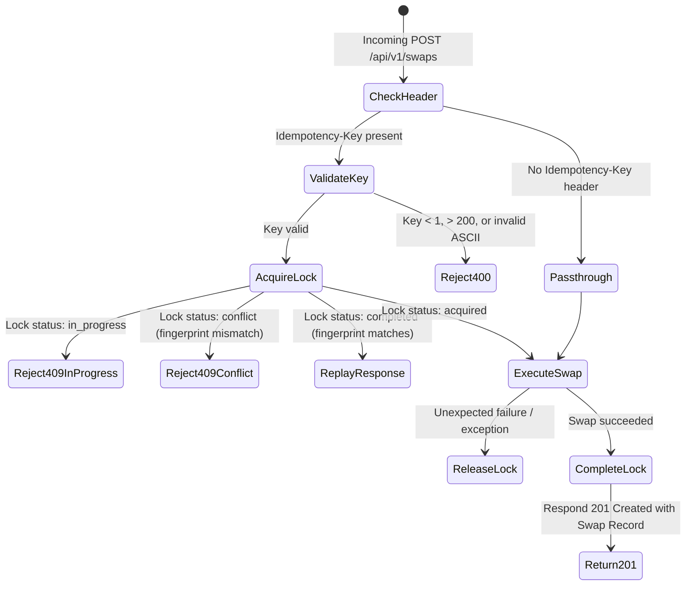

# Concurrency-Safe Swap Idempotency Protocol

This document specifies the concurrency-safe idempotency protocol implemented for financial operations on `POST /api/v1/swaps` (Issue #548).

---

## 1. Overview & Motivation

Financial operations such as currency/token swaps must guarantee **exactly-once execution semantics**. If a client network timeout occurs after submitting a swap, an automated retry must not double-execute the trade or debit liquidity twice.

The `POST /api/v1/swaps` endpoint implements atomic concurrency-safe idempotency using an in-memory lock-and-cache engine:
- **Atomic Acquisition**: An in-progress lock is acquired before executing quote pricing and swap persistence.
- **In-Progress Guarding**: Concurrent requests presenting the same key while execution is underway receive an immediate `409 Conflict` (`request_in_progress`).
- **Deterministic Replay**: Once completed, subsequent requests with identical keys and bodies replay the initial response verbatim with zero re-execution.
- **Payload Conflict Detection**: Attempting to reuse an existing idempotency key with a divergent request body returns a `409 Conflict` (`idempotency_conflict`).
- **Tenant & API Key Isolation**: Idempotency keys are namespaced per tenant/API key prefix to eliminate cross-tenant key collisions.
- **Bounded Retention**: Cache entries expire after a configurable TTL (default 24h) and are bounded by an LRU eviction limit.

---

## 2. Request Header Specification

| Header | Description | Required | Validation Rules |
| :--- | :--- | :--- | :--- |
| `Idempotency-Key` | Unique token generated by client per intended transaction | No | 1–200 characters, printable ASCII (`\x20`–`\x7E`), non-empty/non-whitespace |
| `X-Tenant-Id` | Explicit tenant identifier | No | 1–128 characters, trimmed |
| `Authorization` | Bearer token authentication header | No | Format `Bearer <token>`; first 8 chars used for tenant isolation |
| `X-API-Key` | API key authentication header | No | Format `<token>`; first 8 chars used for tenant isolation |

> When `Idempotency-Key` is omitted, the swap executes normally without caching or replay protection.
> If `Idempotency-Key` is present but invalid (e.g. empty, whitespace-only, >200 characters, or contains non-printable control characters), the request is rejected with `400 Bad Request` (`invalid_request`).

---

## 3. Fingerprinting & Canonicalization

To ensure payload integrity, the engine computes a cryptographic SHA-256 fingerprint over:
1. HTTP Method (`POST`)
2. Request Path (`/api/v1/swaps`)
3. Resolved Tenant ID
4. Canonical JSON representation of the request body (all object keys recursively sorted)

```typescript
const payload = [
  method.toUpperCase(),
  path,
  tenantId,
  canonicalizeBody(body),
].join("::");
const fingerprint = createHash("sha256").update(payload).digest("hex");
```

---

## 4. Execution State Machine



---

## 5. Status Codes & Error Definitions

| Status Code | Error Code | Description |
| :--- | :--- | :--- |
| `201 Created` | N/A | Initial successful swap execution or idempotent replay of a completed swap. |
| `400 Bad Request` | `invalid_request` | Invalid payload or malformed `Idempotency-Key` (e.g. >200 chars, whitespace). |
| `409 Conflict` | `request_in_progress` | Another request with the same idempotency key is actively being processed. Clients should back off and retry. |
| `409 Conflict` | `idempotency_conflict` | The idempotency key was previously used with a different request payload. |

---

## 6. Configuration Environment Variables

| Variable | Default | Description |
| :--- | :--- | :--- |
| `IDEMPOTENCY_TTL_MS` | `86400000` (24h) | Time-to-live for cached swap idempotency records in milliseconds. |
| `IDEMPOTENCY_CACHE_MAX`| `10000` | Maximum number of idempotency records held in memory before oldest-first eviction. |

---

## 7. Storage Engine Interface

The modular `IdempotencyStore` interface allows drop-in replacement of the default in-memory store with external distributed backends (such as Redis or Postgres):

```typescript
export interface IdempotencyStore {
  acquire(
    key: string,
    tenantId: string,
    fingerprint: string,
    ttlMs?: number | undefined,
  ): Promise<LockResult>;

  complete(
    key: string,
    tenantId: string,
    statusCode: number,
    responseBody: unknown,
  ): Promise<void>;

  release(key: string, tenantId: string): Promise<void>;
  reset(): Promise<void>;
}
```
